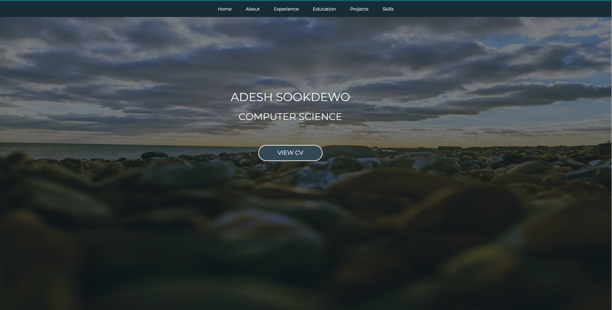

 
  <h1 align="center"><a href="https://www.as15800github.io.org/" target="_blank">Personal Website</a></h1>
  

  A personal website that shows my education, skills, projects and information about me. This website is built using HTML, CSS and JavaScript and hosted using GitHub pages.
  

<h2>Home screenshot</h2>

<h2>About me screenshot</h2>

<h2>Experience screenshot</h2>

<h2>Education screenshot</h2>

<h2>Projects screenshot</h2>

<h2>Skills screenshot</h2>

